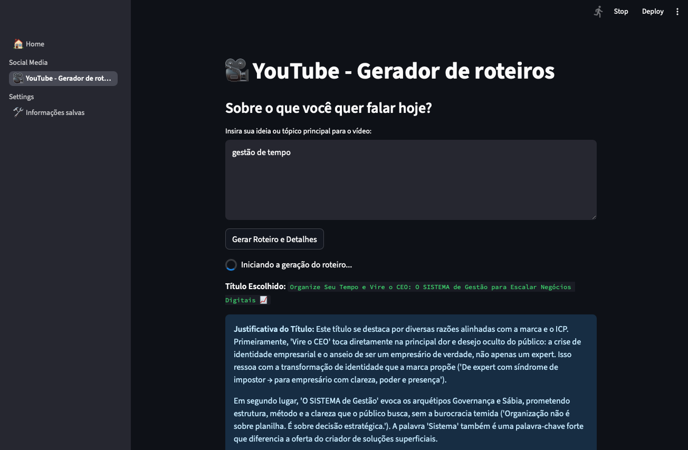

 [](https://streamlit.io/) 

# 🎬 Loki - Social Media Content Generator with Gemini + Streamlit

An interactive AI-powered content assistant for creators who want to ideate, write, design, and optimize content for platforms like **YouTube**, **Instagram**, **TikTok**, and **LinkedIn** — all in one streamlined app.

Built with **Streamlit**, this app uses **Gemini (Google Generative AI)** to generate:

- 📜 Full video scripts with hook, intro, body, and CTA
- 🧠 SEO-optimized video titles with justification
- ✍️ Descriptions and tags tailored for reach
- 🖼️ AI-generated thumbnails based on custom prompts
- 💾 Saved audience/context info to personalize generation

> Currently focused on **YouTube**, but structured to support multi-platform expansion soon.

---

## 🖼️ Preview



---

## ✨ Features

### 📺 YouTube Tools

- Generate detailed video scripts with structure and flow
- Create multiple SEO titles and auto-select the best
- AI-assisted description and keyword/tag generation
- Generate up to 3 unique thumbnail images using Gemini
- Copy entire output to clipboard for publishing

### 🧠 Personalized AI Context

- Save information about your content style and audience
- Reuse context to generate better results across sessions

### 🛠️ Modular Architecture

- Each platform (YouTube, Instagram, etc.) lives in its own file under `pages/`
- Easy to expand: just add a new `.py` page and link it in `main.py`

---

## 🧩 Project Structure

```bash
streamlit/
├── main.py                  # Entry point with Streamlit navigation
├── aux.py                   # Shared utility functions (AI, image, info)
├── pages/
│   ├── home.py              # Home screen (basic welcome/info)
│   ├── youtube.py           # YouTube content generator
│   └── saved_info.py        # Save your creator info & audience profile
```

---

## 💡 How it Works

### 🧠 Powered by:

- [Google Gemini 2.5](https://deepmind.google/technologies/gemini/) (text generation)
- [Gemini image generation](https://ai.google.dev/docs/gemini/generate_images)
- [Streamlit](https://streamlit.io/) (UI and interactivity)
- [Python](https://www.python.org/) (clean, modular backend)
- `dotenv`, `pyperclip`, `Pillow`, and more

---

## 🚀 Running Locally

### 🧱 Prerequisites:

- Python 3.10+
- A `.env` file with your Gemini API key:

```env
GOOGLE_API_KEY=your-key-here
```

### 🧪 Install dependencies:

```bash
pip install -r requirements.txt
```

### ▶️ Launch the app:

```bash
streamlit run main.py
```

---

## 🧠 Planned Platforms

This project is structured to easily support additional social platforms:

| Platform  | Status     | Features (planned)                                  |
| --------- | ---------- | --------------------------------------------------- |
| YouTube   | ✅ Done    | Scripts, SEO titles, descriptions, tags, thumbnails |
| Instagram | 🟡 Planned | Carousel, image prompts                             |
| TikTok    | 🟡 Planned | Script outline, hook generator, timing optimization |
| LinkedIn  | 🟡 Planned | Thought-leadership posts, carousel scripts, titles  |

---

## 📌 Tip

If you're working on content consistently, consider saving your:

- Bio, product, or channel details
- Target audience
- Writing tone or reference examples

> Just go to the **“saved_infos”** page in the app and store them securely for AI reuse.
